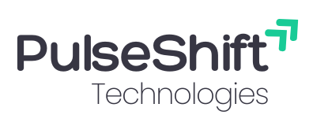

# 🚀 PulseShift

PulseShift is a modern and professional web application designed to showcase services, projects, and client engagement. Built with **React, TailwindCSS, and Framer Motion**, it focuses on sleek design, smooth animations, and responsiveness across all devices.

---

## ✨ Features

- 🎨 **Modern UI/UX** with TailwindCSS  
- ⚡ **Smooth animations** powered by Framer Motion  
- 📱 **Fully responsive design** for mobile, tablet, and desktop  
- 📂 **Services section** with animated cards  
- 📨 **Contact form with social links**  
- 📊 **Projects showcase with stats counters**  
- 📰 **Newsletter subscription**  
- 🔗 **Reusable components** for scalability  

---

## 🌍 Live Demo

🔗 [View Demo](https://pulseshift.netlify.app/)  

---

## 📷 Preview

*(Replace with a screenshot of your app when deployed)*

---

## 🛠️ Tech Stack

Here are the main tools & technologies used in this project:

- ⚛️ **React.js** – Component-based frontend  
- 🎨 **Tailwind CSS** – Styling & responsive design  
- 🎞️ **Framer Motion** – Animations & transitions  
- 📦 **Vite** – Next-gen frontend tooling  
- 🖼️ **Lottie Animations** – Lightweight vector animations  
- 🌐 **JavaScript (ES6+)**  

---

## 📑 Sections

- **Hero Section** – Intro with typing animation  
- **Services** – Web, Mobile, Cloud, and DevOps services  
- **Projects** – Completed, Ongoing, and Client stats  
- **Contact** – Get in touch form & social media icons  
- **Newsletter** – Stay updated with latest news  
- **Footer** – Navigation and company info  

---

## 📊 Project Stats

- ✅ **Projects Completed** – 20+  
- 🔄 **Ongoing Projects** – 5  
- 🤝 **Happy Clients** – 15+  

---

## 📬 Contact

Feel free to reach out if you'd like to collaborate or learn more about **PulseShift**:

- 📧 Email: **abdulcadermohamedsafkhan@gmail.com**  
- 🌐 Portfolio: [GitHub](https://github.com/SafkhanCader) | [LinkedIn](https://linkedin.com/in/mohamed-safkhan-abdul-cader)  

---

